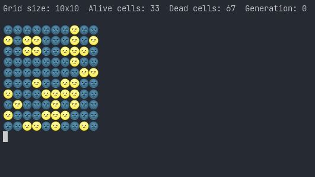

# Game of Life: A Crystal Implementation

This Game of Life code is written in Crystal, just for fun and because I want to learn the language.

This code can be executed as following:

`crystal main.cr`

Or you can compile the code and execute for a better performance:

```
>>> crystal build main.cr
>>> ./main
```

You should see something like from the terminal:

